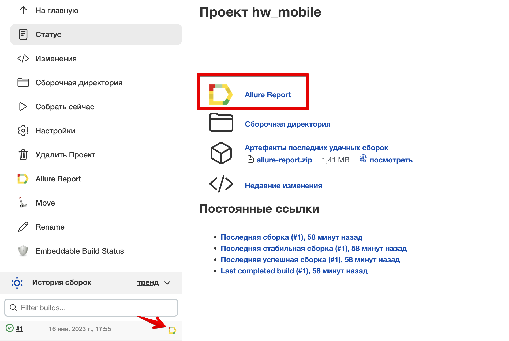

#  Проект по автоматизации тестирования мобильного приложения Wikipedia

##	Содержание

- [Технологии и инструменты](#technologist-технологии-и-инструменты)
- [Реализованные проверки](#bookmark_tabs-реализованные-проверки)
- [Запуск тестов из терминала](#computer-запуск-тестов-из-терминала)
- [Запуск тестов в Jenkins](#-запуск-тестов-в-jenkins)
- [Отчет о результатах тестирования в Allure Report](#-отчет-о-результатах-тестирования-в-Allure-report)
- [Видео пример](#video_camera-Видео)


## :rocket: Технологии и инструменты:

<p  align="center">

<code></code>
<code></code>
<code></code>
<code></code>
<code></code>
<code></code>
<code></code>
<code></code>
</p>

## :heavy_check_mark: Реализованные проверки:

- Проверка функции поиска по тексту
- Проверка текста на стартовом экране
- Проверка добавления языка


## :computer: Запуск тестов из терминала: 


### Локальный запуск тестов:

```bash
gradle clean test
```

##  Запуск тестов в [Jenkins](https://jenkins.autotests.cloud/job/hw_mobile/):
Для запуска сборки необходимо нажать кнопку <code><strong>*Собрать сейчас*</strong></code>.

<p align="center">
  
</p>

После выполнения сборки, в блоке <code><strong>*История сборок*</strong></code> напротив номера сборки появится
значок *Allure Report*, кликнув по которому, откроется страница с сформированным html-отчетом.

<p align="center">
  
</p>


##  Отчет о результатах тестирования в [Allure Report](https://jenkins.autotests.cloud/job/hw_mobile/allure/):

<p align="center">
  
</p>

## :video_camera: Видео пример 
<p align="center">
</a>
</p>
